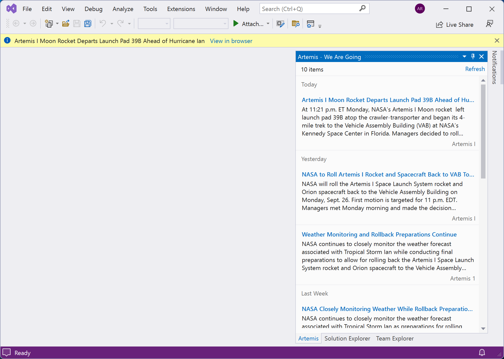
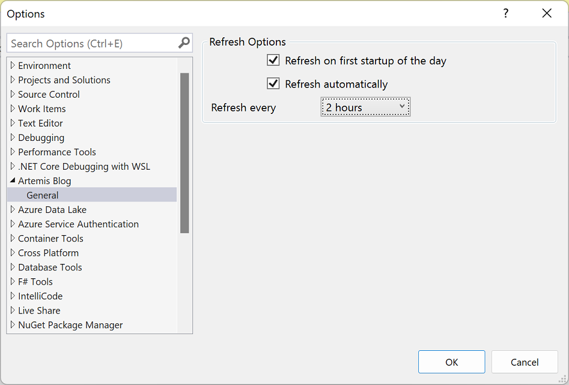

# Artemis Blog

Always stay up to date with the Artemis blog automatically in Visual Studio.

Download this extension from the [Open VSIX Gallery](https://www.vsixgallery.com/extension/a2b9575b-b0f2-417c-952f-42a5b95984b9/).

----------------------------------------------

Get the latest news from NASA about the Artemis mission directly in Visual Studio.

It's simple, it's easy, and it keeps you up-to-date. 

## Open the tool window
Open the *Artemis* tool window from the *View|Other Windows* menu.

## Design
The *Artemis* tool window looks great in any theme and looks like a built-in part of Visual Studio.

## Options
You can decide how often (or if) you want the feed refreshed from the standard *Tools|Options* dialog.

### Known Issues

Uninstalling the extension does not completely remove everything. File Feed.xml remains in folder %ProgramData%\Artemis Blog and the registry entries that store the refresh options aren't removed.

## License
[Apache 2.0](LICENSE)
